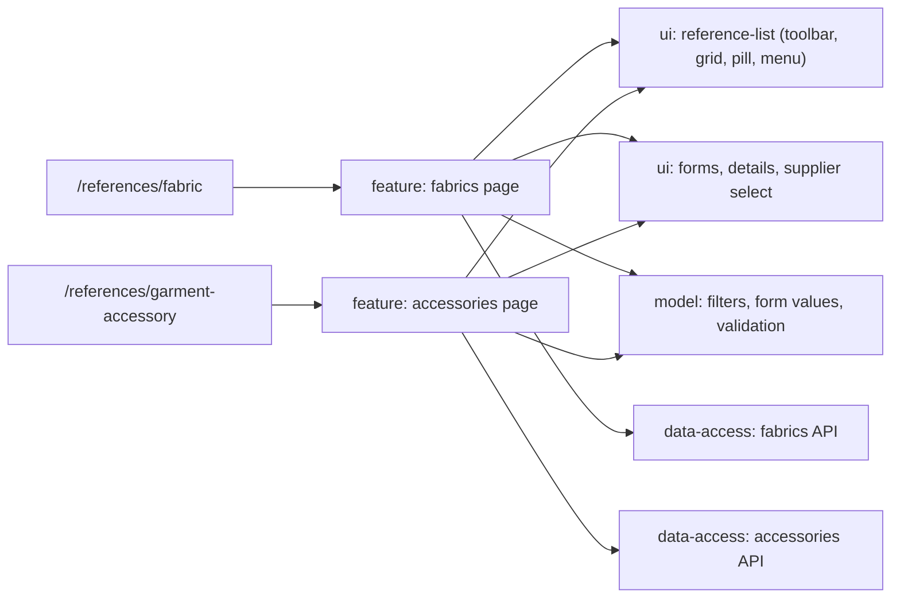

# Admin: Fabrics and Accessories

**Status:** two «Цех» pages with the Calculator sheet fields, 2026-11-02.

«Тканини» (`/references/fabric`) and «Фурнітура» (`/references/garment-accessory`)
are separate sidebar items; the old `?tab=fabrics` link redirects to the fabrics
page. Each page has the «Цех» header, a toolbar with search and activity chips,
a Data Grid with code, names, supplier, price, price date and status pill, a row
menu, bulk deletion, and an editor drawer. Fabrics add RU names, composition,
density and the КП description; accessories add the unit (шт., м, послуга). The
sheet data was moved once through the backend import endpoint; the Admin has no
upload ([SDD 013](../../../specs/admin/references/013-fabrics-accessories-sheet/README.md)).

## Structure diagram


```mermaid
flowchart LR
  FabricRoute["/references/fabric"] --> FabricsPage["feature: fabrics page"]
  AccessoryRoute["/references/garment-accessory"] --> AccessoriesPage["feature: accessories page"]
  FabricsPage --> List["ui: reference-list (toolbar, grid, pill, menu)"]
  AccessoriesPage --> List
  FabricsPage --> Forms["ui: forms, details, supplier select"]
  AccessoriesPage --> Forms
  FabricsPage --> Model["model: filters, form values, validation"]
  AccessoriesPage --> Model
  FabricsPage --> FabricsAPI["data-access: fabrics API"]
  AccessoriesPage --> AccessoriesAPI["data-access: accessories API"]
```

## Code structure

```text
libs/admin/references/
├── data-access/src/
│   ├── api/{fabrics,garment-accessories}/*.api.ts # endpoints
│   ├── contracts/{fabrics,garment-accessories}/ # generated DTO aliases
│   ├── validators/{fabrics,garment-accessories}/ # response validation
│   └── mappers/{fabrics,garment-accessories}/ # DTO -> domain
├── feature/src/
│   ├── components/{fabrics,garment-accessories}/*-drawer.tsx # editor drawers
│   ├── components/reference-list/reference-page-header.tsx # «Цех» header
│   ├── hooks/{fabrics,garment-accessories}/ # list, editor, deletion
│   ├── pages/{fabrics,garment-accessories}/*-page.tsx # pages
│   ├── testing/reference-fixtures.ts # API rows for page tests
│   └── references.routes.tsx # routes and the ?tab=fabrics redirect
├── model/src/
│   ├── entities/{fabrics,garment-accessories}/ # types, units
│   ├── forms/{fabrics,garment-accessories}/ # form values, КП suggestion
│   ├── mappers/reference-lists/reference-format.ts # UAH and date formatting
│   ├── queries/{fabrics,garment-accessories,reference-lists}/ # search and activity
│   └── validators/{fabrics,garment-accessories}/ # form rules
└── ui/src/components/
    ├── reference-list/ # toolbar, data grid, status pill, row menu, footer
    ├── reference-editor/ # drawer, form section, details list, supplier select
    ├── fabrics/ # grid, form, details, delete dialog
    └── garment-accessories/ # grid, form, details, delete dialog
```

**Where to look:** [routes](../../../../libs/admin/references/feature/src/references.routes.tsx), [fabrics page](../../../../libs/admin/references/feature/src/pages/fabrics/fabrics-page.tsx), [accessories page](../../../../libs/admin/references/feature/src/pages/garment-accessories/garment-accessories-page.tsx), [shared grid](../../../../libs/admin/references/ui/src/components/reference-list/reference-data-grid.tsx), [fabrics API](../../../../libs/admin/references/data-access/src/api/fabrics/fabrics.api.ts), [accessories API](../../../../libs/admin/references/data-access/src/api/garment-accessories/garment-accessories.api.ts).

## Tests

- `libs/admin/references/data-access/src/mappers/<fabrics|garment-accessories>/*.unit.test.ts`, shared `libs/admin/references/data-access/src/api/integration/references.api.integration.test.ts`
- `libs/admin/references/feature/src/pages/<fabrics|garment-accessories>/*.component.test.tsx`
- `apps/admin-react/src/app/router/app-router.integration.test.tsx` (sidebar items and redirect)
- E2E (run only on request): `apps/admin-react-e2e/src/garment-accessories.spec.ts`

Focused run: `npx nx test admin-references-data-access -- fabrics garment-accessories`; `npx nx test admin-references-feature -- fabrics garment-accessories`.
