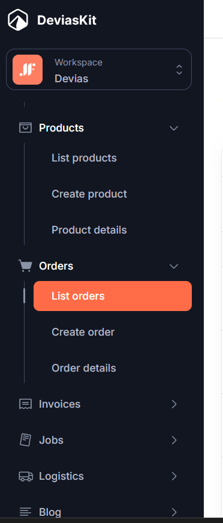
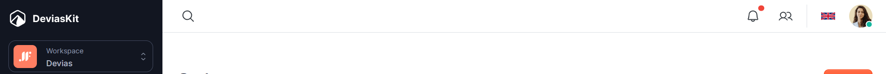
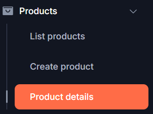
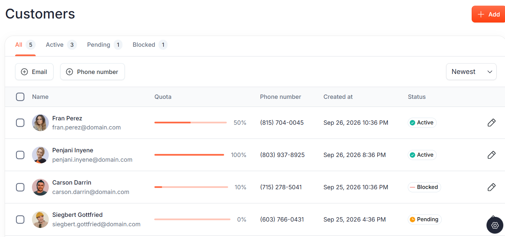
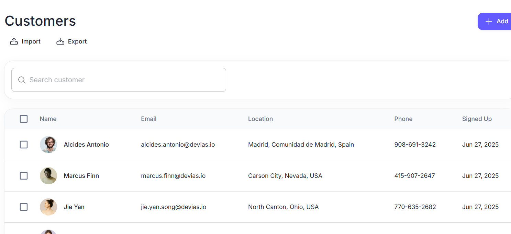
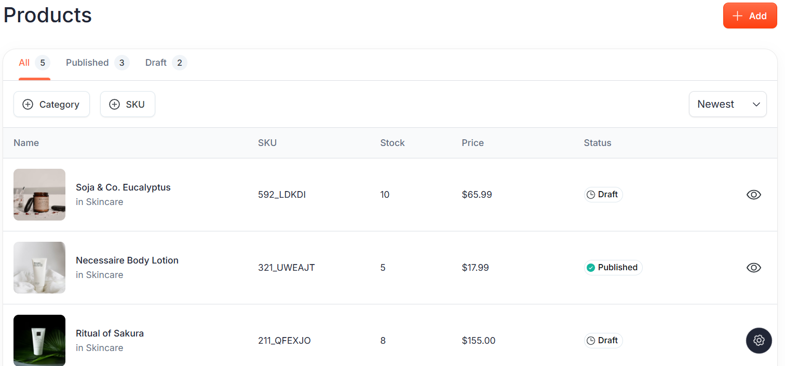
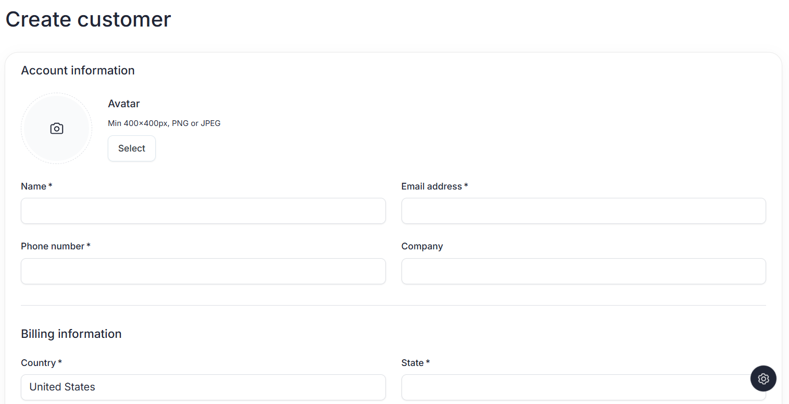
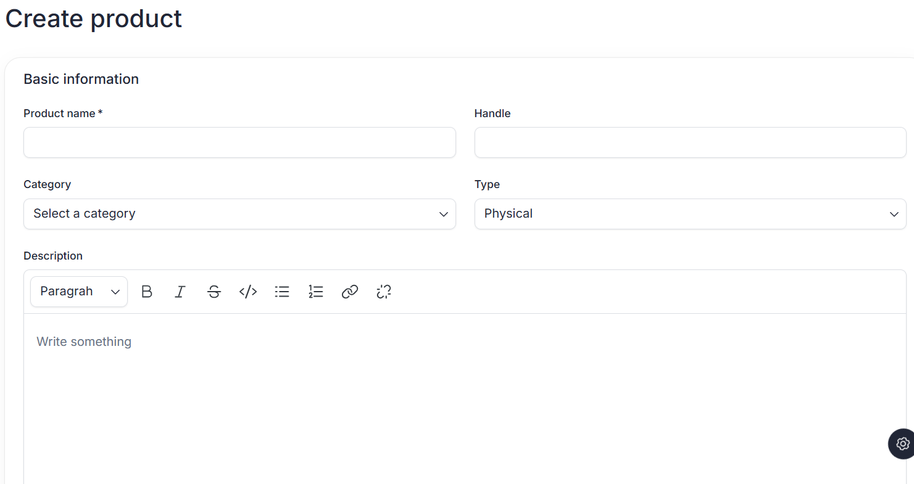
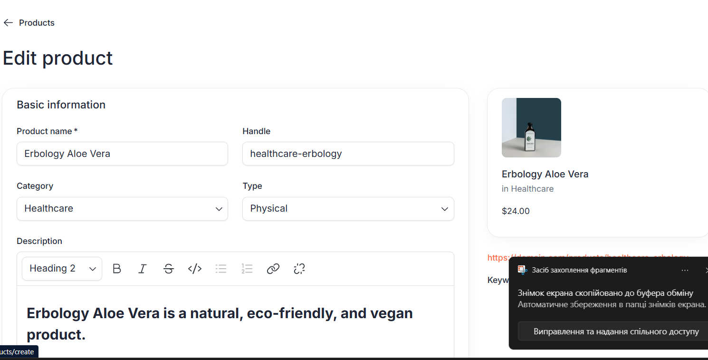
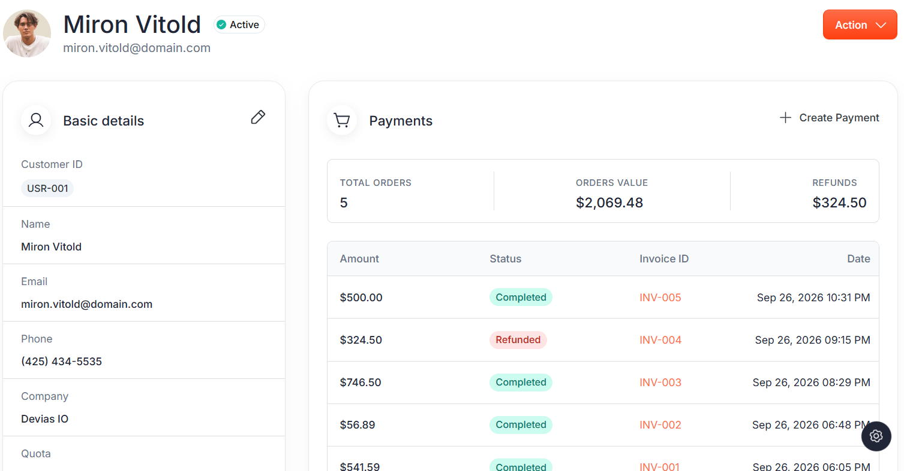

# Візуальні орієнтири для React Admin

Користувач надав десять зображень як приклади списків, форм, меню й шапки. [Усі оригінальні вкладення та їхні нові імена](assets/visual-references/README.md) збережено в репозиторії. Вони показують композицію: виразний заголовок, світлу поверхню таблиці, чіткий toolbar, відділені рядки, помітну дію створення, видимий поточний пункт у темній навігації та компактну шапку. Форми групують поля за змістом і показують помилки поруч із полем. Детальна сторінка дає зворотний перехід.

Це **референс подачі**, не модель даних Brevi і не доказ наявності функцій. Імена Customers/Products, аватари, quota, status, SKU, stock, import/export, мови, notifications, payments, rich-text editor і вигадані записи не переносяться без окремого backend-контракту та feature-SDD. Інтерфейс залишається українським і використовує корпоративну тему Brevi з [shell feature](shell/001-react-admin-shell-theme/README.md).

Для наявних справочників застосовувати MUI Material та безкоштовний `@mui/x-data-grid` (пакет уже є у `package.json`). Зберігати чотири старі сторінки, а їх шість таблиць планувати окремими feature. У двох парних сторінках вкладки означають різні таблиці, а не нові пункти основного меню. Toolbar має показувати лише дії, реалізовані для конкретної таблиці; контекстне меню Angular можна замінити доступним рядковим меню MUI без зміни бізнес-поведінки. Після перенесення кожної feature перевіряти обидві теми та вузький/широкий екран.

## Меню та шапка

## Таблиці

## Форми та деталі

