# Візуальні орієнтири для React Admin

Користувач надав двадцять два зображення як приклади списків, форм, меню,
шапки й окремих сторінок деталей. [Усі оригінальні вкладення та їхні нові
імена](assets/visual-references/README.md) збережено в репозиторії. Вони
показують композицію: виразний заголовок, світлу поверхню таблиці, чіткий
toolbar, відділені рядки, помітну дію створення, видимий поточний пункт у
темній навігації та компактну шапку. Форми групують поля за змістом і показують
помилки поруч із полем. Детальна сторінка дає зворотний перехід.

Для нових сторінок create/edit/detail усі поля й дані розміщуються на білих
поверхнях MUI `Card` або `Paper`, а не безпосередньо на фоні сторінки. Великий
обсяг інформації розділяється на семантичні фрейми. На широкому екрані фрейми
можуть стояти поруч, на вузькому — послідовно в одну колонку. Create та edit
використовують одну структуру форми: create починається з порожніх editable
полів, edit завантажує поточні значення. Detail є лише для читання й містить
кнопку переходу до edit.

Це **референс подачі**, не модель даних Brevi і не доказ наявності функцій. Імена Customers/Products, аватари, quota, status, SKU, stock, import/export, мови, notifications, payments, rich-text editor і вигадані записи не переносяться без окремого backend-контракту та feature-SDD. Інтерфейс залишається українським і використовує корпоративну тему Brevi з [shell feature](shell/001-react-admin-shell-theme/README.md).

Для наявних справочників застосовувати MUI Material та безкоштовний `@mui/x-data-grid` (пакет уже є у `package.json`). Зберігати чотири старі сторінки, а їх шість таблиць планувати окремими feature. У двох парних сторінках вкладки означають різні таблиці, а не нові пункти основного меню. Toolbar має показувати лише дії, реалізовані для конкретної таблиці; контекстне меню Angular можна замінити доступним рядковим меню MUI без зміни бізнес-поведінки. Після перенесення кожної feature перевіряти обидві теми та вузький/широкий екран.

## Меню та шапка

## Таблиці

## Форми та деталі

### Окремі сторінки деталей

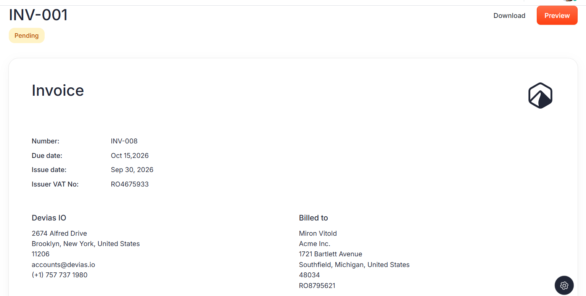

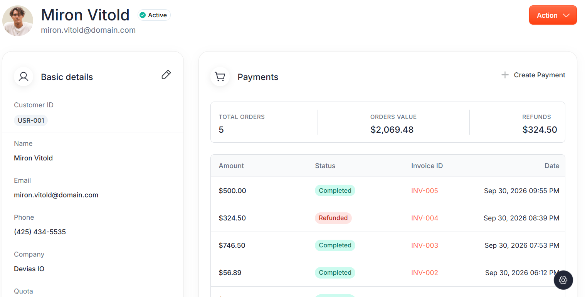

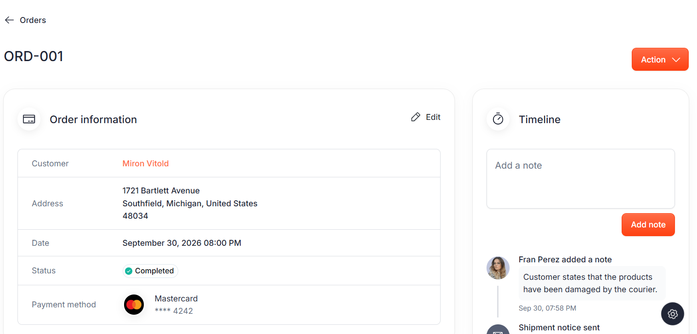

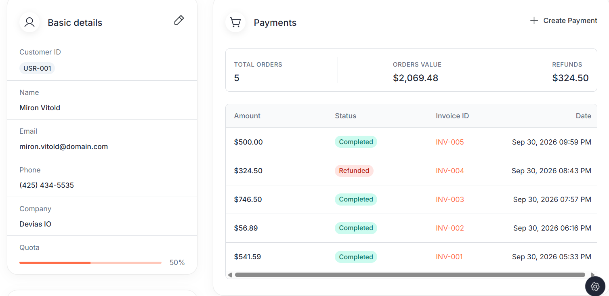

### Сторінки створення й редагування

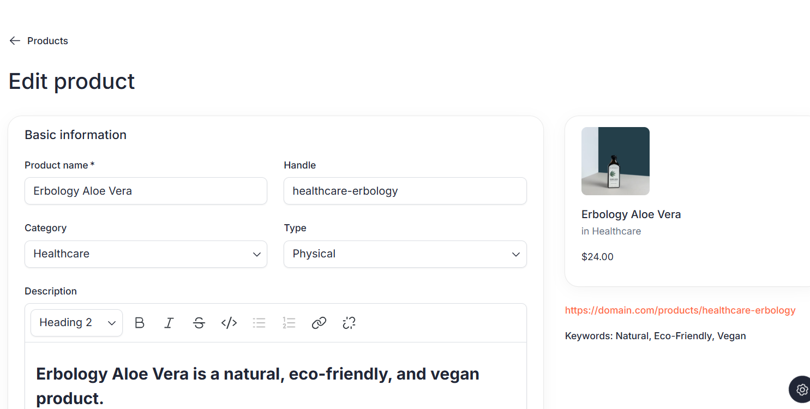

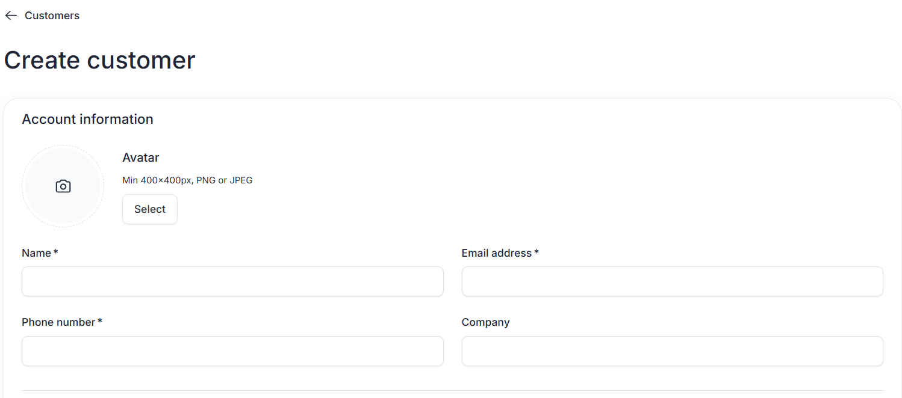

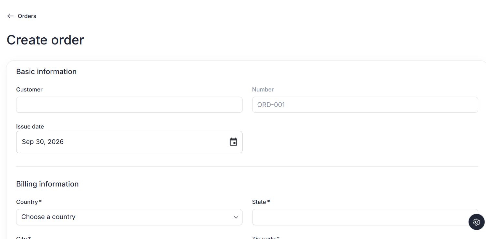

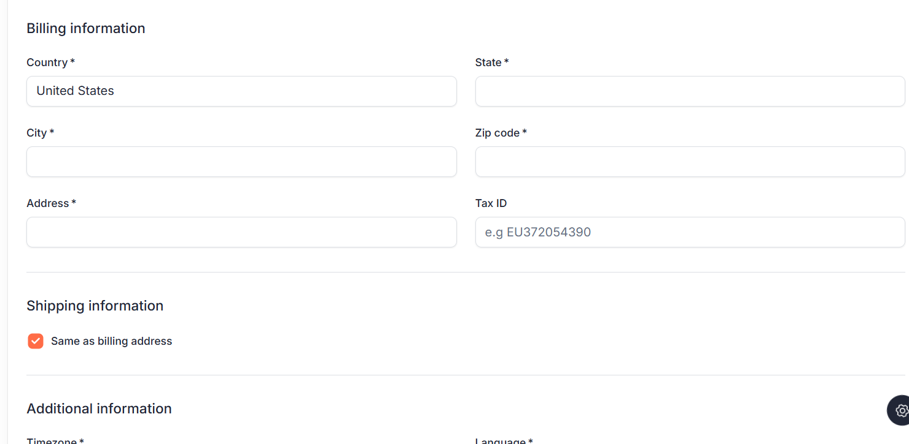

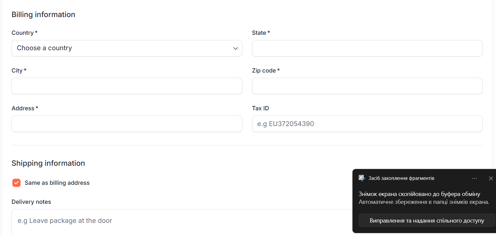

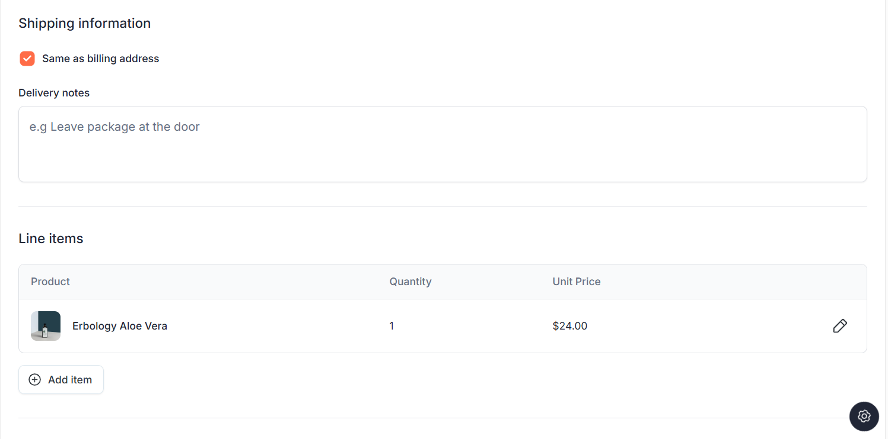

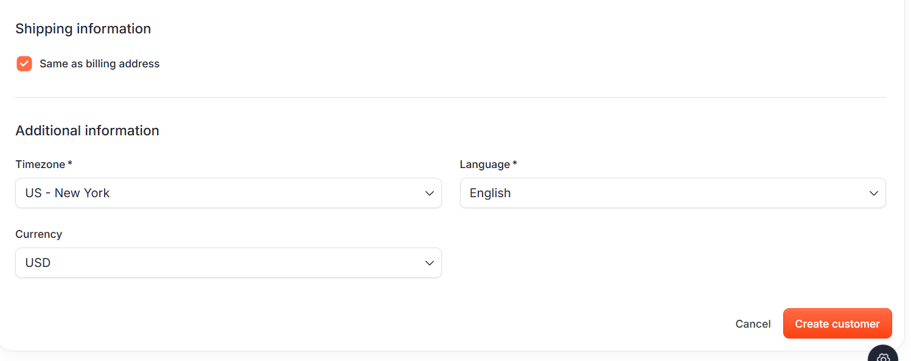

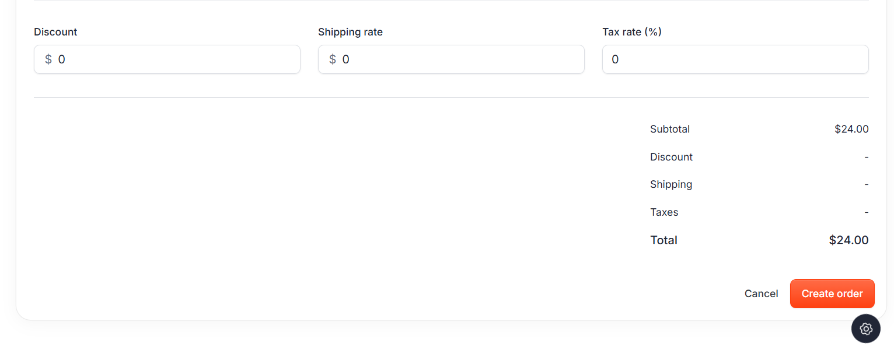
